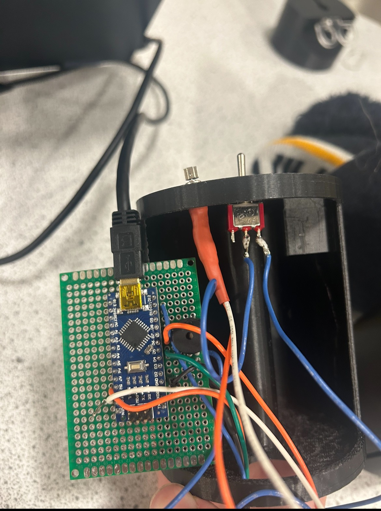
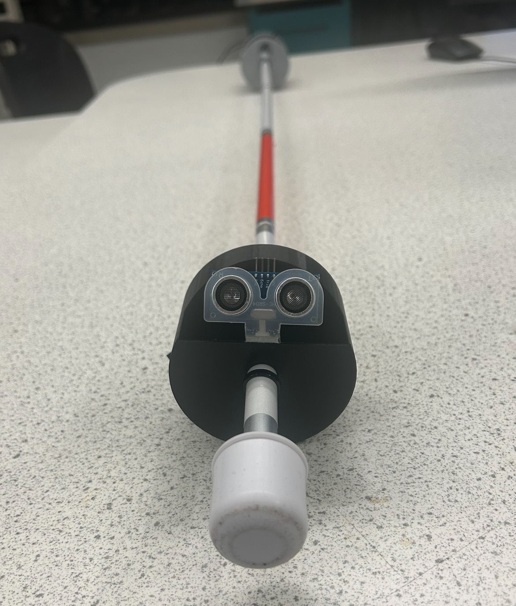
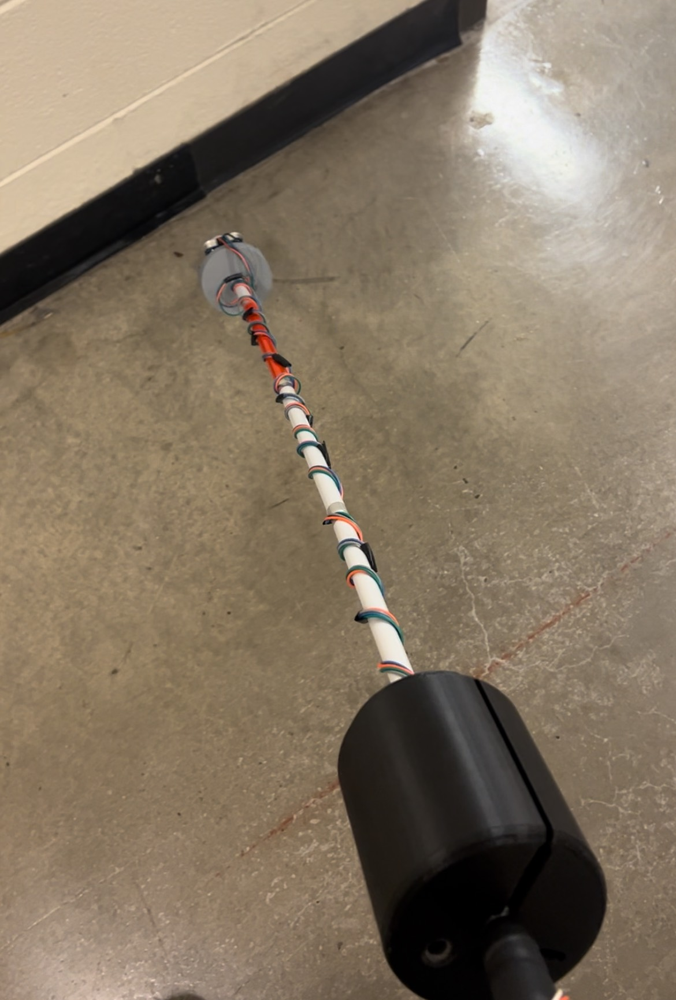

# Ultrasonic Distance-Sensing White Cane
An Arduino-based cane for the visually impaired that uses a distance sensor and haptic feedback to give real time information about surroundings. 

## IMPORTANT:
This project is a work in progress. Iteration and modification may be necessary for reliable daily usage!

## Overview
Our project is a modified blind cane for the visually impaired that helps to reduce collisions while navigating. To accomplish this, we implemented an ultrasonic distance sensor along with a buzzer to alert the user when they are close to objects through vibration and sound. By using readily available components, 3D printed housing, and a pre-existing blind cane, we have created a widely accessible and affordable navigational aid. Our white cane is much cheaper to produce than commercially available alternatives, and is entirely open source for improvements and alterations. We hope that our resourceful design empowers more users with greater confidence and independence.

## Images and Demonstrations
<table>
  <tr>
    <td align="center">
       
      <em>Our first soldered perfboard being fitted into the case </em>
    </td>
    <td align="center">
       
      <em>The second iteration of the sensor mount </em>
    </td>
    <td align="center">
       
      <em>A fully assembled initial prototype</em>
    </td>
  </tr>
</table>

### Demo video here

## Features
-Entirely open sourced
-Much cheaper to produce as compared to commercial alternatives
-Rechargable battery via USB-C for accessibility
-Weight distribution is optimal for daily navigation

## Cost of development vs. commercial alternatives

| Device | Price per Unit | Precision | Notes |
|--------|----------------|-----------|-------|
| [WeWalk Smart Cane 2](https://floridareading.com/products/wewalk-smart-cane-2-with-voice-assistant) | $1,050 | High | Extremely expensive, but has extensive features. |
| [Saarthi Smart Aid](https://enablemart.in/shop/saarthi-smart-aid-smart-cane/) | $54.17 | Mid-High | Much more affordable, but sourced overseas and not readily available for the American market. |
| **This White Cane** | **~$51.69** | Mid | Highly portable, easy and cheap to produce, but low precision. Strong applications in low-resource environments. |

## Use Cases and Applications

# BILL OF MATERIALS

| # | Item               | Purpose           | Qty. | Cost/Unit Part | Cost |
|---|--------------------|------------------|------|----------------|------|
| 1 | HC-SR04            | Ultrasonic Sensor | 1    | $4             | $4   |
| 2 | Arduino Nano       | Microcontroller   | 1    | $5             | $5   |
| 3 | JYCL0610R2540      | Vibration Motor   | 3    | $2             | $6   |
| 4 | MakerFocus 3.7V 3000mAh Lipo | LiPo Batteries | 2 | $9 | $18 |
| 5 | MT3608             | Step Up           | 1    | $1             | $1   |
| 6 | TP4056             | Charge Protector  | 1    | $2             | $2   |
| 7 | Cane               | Cane              | 1    | $15            | $15  |
**Total:** $51

## Circuit Diagram

## Firmware Overview

### Pin Assignments

### Setup Instructions
- Assemble the circuit as described above
- Connect the Arduino board to your computer via USB
- Open the provided .ino file in the Arduino IDE
- Select the appropriate port and board type (Nano)
- Upload the code to the Nano
- Disconnect from USB and power via 5v LIPO

### Behavior table

### Code Snippet

For the full firmware, see 

## Development process and challenges
### Initial Vision: 

### Power Struggles

### Perfboarding

### Firmware Logic

### Hardware Limitations & Planned Improvements
| Issue                    | Description                                              | Planned Fix                                                                 |
|--------------------------|----------------------------------------------------------|------------------------------------------------------------------------------|
| Battery reliability      | 5V LIPO is vulnerable to weather interference.                  | Improve waterproofing and make the housing more robust|

